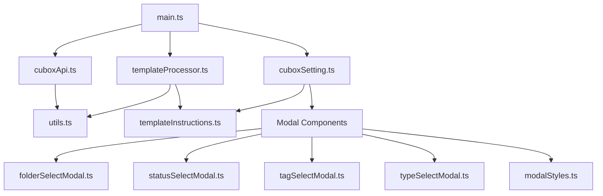
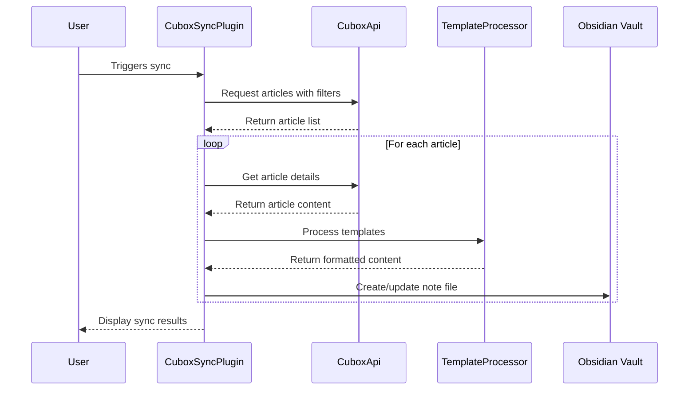

# Obsidian Cubox Plugin - Development Guide

## Overview

The Obsidian Cubox plugin allows users to sync articles and annotations from Cubox to Obsidian. This document provides a comprehensive guide to the project's architecture, components, and workflows to help developers quickly understand and contribute to the project.

## Project Architecture

The plugin is structured around several core components that work together:



### Core Components

1. **Main Plugin (main.ts)**: Entry point that initializes the plugin, manages syncing, and coordinates between components
2. **API Client (cuboxApi.ts)**: Handles communication with the Cubox service
3. **Template Processor (templateProcessor.ts)**: Processes templates for note filename, metadata, and content
4. **Settings Manager (cuboxSetting.ts)**: Manages plugin settings and UI
5. **Modal Components (modal/*)**: Provides UI for selecting filters and options
6. **Utilities (utils.ts)**: Common utility functions

## Data Flow



## Key Interfaces

### Cubox Data Structures

```typescript
// Article structure from Cubox API
interface CuboxArticle {
    id: string;
    title: string;
    article_title: string;
    description: string;
    url: string;
    domain: string;
    create_time: string;
    update_time: string;
    word_count: number;
    content?: string;
    cubox_url: string;
    highlights?: CuboxHighlight[];
    tags?: string[];
    type: string;
}

// Highlight structure from Cubox API
interface CuboxHighlight {
    id: string;
    text: string;
    image_url?: string;
    cubox_url: string;
    note?: string;
    color: string;
    create_time: string;
}

// Folder structure from Cubox API
interface CuboxFolder {
    id: string;
    name: string;
    nested_name: string;
    uncategorized: boolean;
}

// Tag structure from Cubox API
interface CuboxTag {
    id: string;
    name: string;
    nested_name: string;
    parent_id: string | null;
}
```

### Plugin Settings

```typescript
// Main plugin settings
interface CuboxSyncSettings {
    domain: string;
    apiKey: string;
    syncFrequency: number;
    targetFolder: string;
    filenameTemplate: string;
    frontMatterVariables: string[];
    contentTemplate: string;
    dateFormat: string;
    lastSyncTime: number;
    lastSyncCardId: string;
    lastCardUpdateTime: string;
    folderFilter: string[];
    typeFilter: string[];
    statusFilter: string[];
    tagsFilter: string[];
    isRead: boolean;
    isStarred: boolean;
    isAnnotated: boolean;
    syncing: boolean;
}
```

## Cubox API Integration

The plugin interacts with the Cubox API through the `CuboxApi` class. Key endpoints include:

1. **Card Filtering**: `/c/api/third-party/card/filter`
   - Retrieves articles matching specified filters
   - Supports pagination via `last_card_id` and `last_card_update_time`

2. **Content Retrieval**: `/c/api/third-party/card/content`
   - Retrieves detailed content of a specific article

3. **Folder List**: `/c/api/third-party/group/list`
   - Retrieves user's folder structure

4. **Tag List**: `/c/api/third-party/tag/list`
   - Retrieves user's tag list

### Authentication

The API uses Bearer token authentication via the user's Cubox API key:

```typescript
headers: {
    'Authorization': `Bearer ${this.apiKey}`,
    'Content-Type': 'application/json',
}
```

## Template System

The plugin uses [Mustache.js](https://mustache.github.io/) for template rendering with a rich set of variables:

### Filename Template
Variables like `{{title}}`, `{{article_title}}`, `{{create_time}}`, etc.

### Front Matter (Metadata)
Supports all article properties with optional aliases (e.g., `title::customTitle`).

### Content Template
Rich template with support for article content, highlights, and metadata.

Special features:
- `{{content_highlighted}}`: Content with highlights marked using Obsidian's highlight syntax (`==highlighted text==`)
- Nested highlight properties: `{{text}}`, `{{note}}`, `{{color}}`, etc.

## Modal System

The plugin includes custom modal dialogs for selecting:

1. **Folders**: `folderSelectModal.ts`
2. **Status**: `statusSelectModal.ts` (read, starred, annotated)
3. **Tags**: `tagSelectModal.ts`
4. **Types**: `typeSelectModal.ts` (article, webpage, etc.)

These modals share a common styling approach defined in `modalStyles.ts` and provide a consistent UI for filter selection.

## Syncing Workflow

1. **Initialization**:
   - Plugin loads settings and initializes API and template processor
   - Sets up automatic sync interval if configured

2. **Sync Process**:
   - Ensures target folder exists
   - Fetches articles matching filters from Cubox
   - For each article, retrieves content and processes templates
   - Creates/updates files in the target folder
   - Tracks last sync position for pagination
   - Skips existing files based on Cubox ID in front matter

3. **Deduplication**:
   - Files are identified by their Cubox ID stored in front matter
   - Prevents duplicate imports of the same content

## Utilities

The `utils.ts` module provides helper functions for:

1. **File Safety**: Handling illegal characters in filenames
2. **Date Formatting**: Using Luxon for consistent date formatting

## Dependencies

- **[Obsidian API](https://github.com/obsidianmd/obsidian-api)**: Core API for Obsidian integration
- **[Mustache.js](https://mustache.github.io/)**: Template rendering
- **[Luxon](https://moment.github.io/luxon/)**: Date manipulation and formatting

## Development Workflow

1. Clone the repository
2. Install dependencies: `npm install`
3. Build the plugin: `npm run build`
4. For testing, copy or symlink the build output to your Obsidian plugins folder

## Extending the Plugin

### Adding New Filters
1. Create a new modal component in the `modal/` directory
2. Add appropriate settings in `cuboxSetting.ts`
3. Update API parameters in `cuboxApi.ts`

### Enhancing Templates
1. Add new variables to the template system in `templateProcessor.ts`
2. Update template instructions in `templateInstructions.ts`
3. Ensure proper documentation in the settings UI

## Common Patterns

### API Response Handling

```typescript
try {
    const response = await this.request(path) as ApiResponse;
    return response.data ?? [];
} catch (error) {
    console.error('API request failed:', error);
    throw error;
}
```

### Template Processing

```typescript
// Create view model with formatted data
const view = {
    title: article.title || '',
    create_time: formatDateTime(article.create_time, this.dateFormat),
    // Additional properties...
};

// Render template with Mustache
const result = Mustache.render(template, view);
```

### Settings Management

```typescript
// Update setting
this.plugin.settings.someSetting = value;
await this.plugin.saveSettings();

// Apply setting change
this.plugin.updateComponent(value);
```
